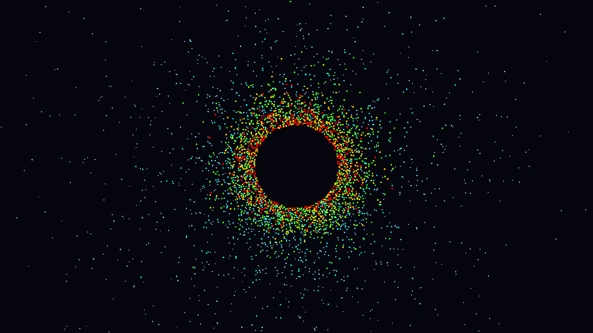

# Particle simulation

This is a very simple particle simulation system. It does not have much resemblance to actual physics.
The features implemented:

1. The particles repel each other at close distances. No attraction forces between particles.
2. They bounce off the walls and off the central circle.
3. They are colored according to their mass (rainbow colors with red being the heaviest)
4. They are depicted as simple squares with the edge size of `∛mass`
5. They gravitate towards the central circle

The goal of the simulation is two-fold:
  * produce something visually similar to a planet's atmosphere
  * demonstrate a multi-step compute pipeline

Because of different masses the heavier particles tend to settle towards the central circle so eventually (10-20 minutes at 144 FPS)
you should see something like this:

# Funny bug
I decided to not fix this one because I think it actually has quite some educational value.
When you start the simulation you can observe some "particle density rays"
between approximately the 5th and the 30th seconds of the simulation.
Also it is easy to observe that the right part (and the bottom part) collapses much faster than the left (and the top).
The reason for that is... FP32! I never expected to see a KSP Kraken in such a small program, but there you go.

# Further development
This project (and possibly some others) is planned to be further developed at

[github.com/snakeru/wgpu-particles](https://github.com/snakeru/wgpu-particles)
